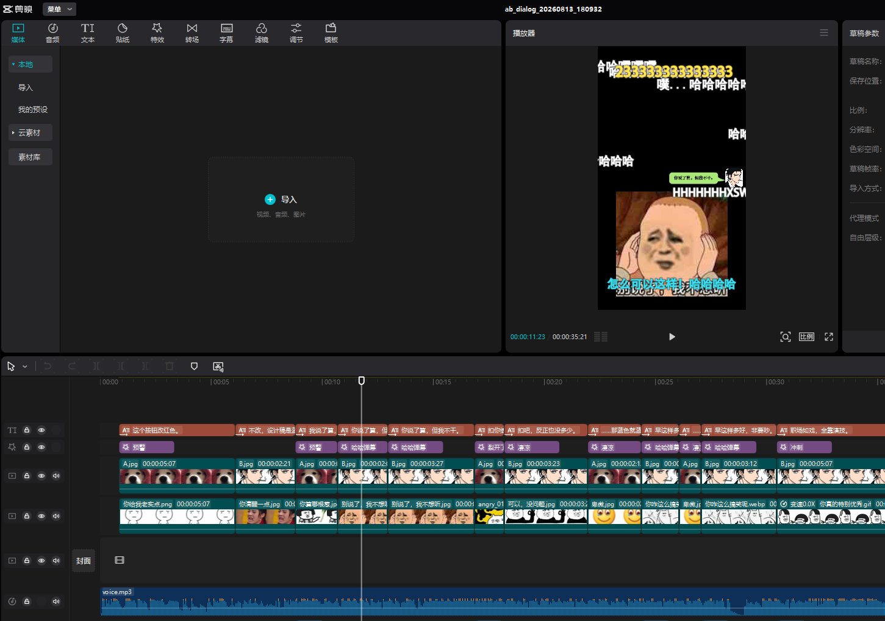

# Gospel Video · 福音吐槽风微信聊天视频生成器

把一段**对话剧本 + 一段配音音频**自动变成**剪映专业版可编辑草稿**：微信聊天界面逐条弹出气泡（A 左/白、B 右/绿），配头像、表情贴纸、画面特效、音效，全程与语音毫秒级对齐——不用 TTS、不切音频、不手动拉时间轴。

**主打能力：AB 双人对话模式**（`scripts/ab_generator.py`），开箱即用、单文件入口。另有完整流水线（TTS 配音 → 聊天画面渲染 → 剪映组装，`gospel_automator.py`）作为可选扩展。

## 功能特性

- 🎙️ **ASR 毫秒级音画对齐**：faster-whisper 词级时间戳 + 全局 DP 对齐，抗口误/繁简/重复段；唱词反复/重录段按**卡拉OK式独立弹出**；时间轴连续无空窗。
- 💬 **微信聊天样式**：剪映内置「会话」气泡（A=左侧=对方=白色，B=右侧=自己=绿色），矩形圆角头像（圆角 50）。
- 🧩 **素材决策由你（主 agent / 大模型）在对话中完成**：脚本不做关键词硬匹配，贴纸/音效/画面特效由你按剧情语义挑选并写入中间 JSON（plan），脚本机械执行——匹配成功率远高于关键词规则。
- 🎬 **输出即剪映草稿**：生成到剪映默认草稿目录，打开剪映即可编辑/导出；无需其他工具链。
- 🏷️ **重录/反复唱词**：歌曲中整句/句尾的重复演唱，自动识别为独立出现并重新弹出气泡（卡拉OK式），画面不中断。

## 效果预览

下方为剪映专业版草稿编辑器截图（`samples/ab_demo_boss_dev/`，9 句老板/主角职场对话，12 段卡拉OK式时间轴：第3句句尾重唱、第6/7句整句重录重新弹出）。



## 环境要求

| 依赖 | 说明 |
|---|---|
| Python 3.9+ | 推荐 3.11+ |
| 剪映专业版 5.9+ | 输出为其可编辑草稿（Windows/macOS） |
| faster-whisper | ASR 对齐，首次运行自动下载 small 模型（约 460MB） |
| pyJianYingDraft | 随仓库分发于 `vendor/`，无需安装；可用环境变量 `PYJYD_VENDOR` 覆盖 |

## 快速开始

仓库自带一个可跑通的完整示例（`samples/ab_demo_boss_dev/`，含对话剧本 + 配音 + 完整 plan），clone 后可以直接试：

```bash
# 1. 克隆 + 安装依赖
git clone https://github.com/newued/gospel-video
cd gospel-video
pip install -r requirements.txt
# 首次运行会自动下载 faster-whisper small 模型（约 460MB，需联网一次）

# 2a. 最快试一下：plan 模式（已含素材决策，直接出完整效果）
python scripts/ab_generator.py --plan-json samples/ab_demo_boss_dev/plan.json
# → 打开剪映 → 草稿箱 → 找到 ab_dialog_<时间戳> 即可编辑

# 2b. 体验完整流程：auto 模式（ASR 对齐）→ 导出 plan → plan 模式
python scripts/ab_generator.py \
    --dialog-json samples/ab_demo_boss_dev/dialog.json \
    --audio-mp3  samples/ab_demo_boss_dev/voice.mp3 \
    --output-draft out/ --export-plan plan.json
# 然后在 plan.json 的 sticker/effect/audio 轨填素材决策（详见下方"两种用法"），再：
python scripts/ab_generator.py --plan-json plan.json
```

> 角色名支持中文自动映射：剧本中**先出现的角色 → A（左/白/对方）**，后出现的 → **B（右/绿/自己）**。`samples/ab_demo_boss_dev/dialog.json` 演示了中文映射（老板/主角）。

## AB 双人对话模式：两种用法

### 用法一：自动模式（推荐，配音 + 剧本 → 草稿）

```bash
python scripts/ab_generator.py \
    --dialog-json samples/ab_demo_boss_dev/dialog.json \
    --audio-mp3  samples/ab_demo_boss_dev/voice.mp3 \
    --output-draft out/ \
    --export-plan plan.json        # 可选：同时导出中间 plan 供你审查/改素材
```

流程：ASR 识别音频 → 词级 DP 对齐每句时间戳（反复/重录段自动卡拉OK式展开）→ 生成剪映草稿。

### 用法二：plan 驱动模式（主 agent 写素材决策 → 草稿）

脚本**不做**贴纸/音效/特效的关键词硬匹配；由你在对话中按语义挑选素材，写入中间 JSON 的对应轨道，脚本机械执行：

```bash
# 1) 先跑自动模式导出 plan（或手写中间 JSON）
python scripts/ab_generator.py \
    --dialog-json samples/ab_demo_boss_dev/dialog.json \
    --audio-mp3  samples/ab_demo_boss_dev/voice.mp3 \
    --export-plan plan.json
# 2) 你审查 plan.json，在 sticker / effect / audio(音效) 轨的 material 字段填素材
#    （贴纸填 assets/emojis 下的文件名；特效用剪映内置名如"预警/裂开了/哈哈弹幕"；音效填 assets/sfx 下的文件名）
# 3) 重新生成（秒出，不重跑 ASR）
python scripts/ab_generator.py --plan-json plan.json
```

`samples/ab_demo_boss_dev/plan.json` 是一份**已填好素材决策**的完整示例，可直接走用法二跳过第 2 步。中间 JSON schema 详见 [docs/AB_DIALOG_GUIDE.md](docs/AB_DIALOG_GUIDE.md)。

## 完整流水线（可选，需搭配 jianying-editor）

`gospel_automator.py` 是完整流水线（TTS 多角色配音 → 聊天画面 webm 渲染 → 剪映组装），依赖 [jianying-editor](https://github.com/your-fork/jianying-editor) 提供 TTS/云素材库/原生贴纸能力：

```bash
export JY_SKILL_ROOT=/path/to/jianying-editor   # 指向该 skill 根目录
python scripts/gospel_dialog.py -f samples/emperor_wisdom.txt -m manual
```

未安装 jianying-editor 时该入口会给出明确提示；**AB 双人对话模式不受影响**。

## 目录结构

```
gospel-video/
├── SKILL.md                  # 技能说明（含主 agent 工作流契约）
├── scripts/
│   ├── ab_generator.py       # ★ AB 双人对话模式入口（开箱即用）
│   ├── gospel_automator.py   # 完整流水线（可选，需 jianying-editor）
│   ├── gospel_dialog.py      # 完整流水线 CLI
│   ├── chat_scene_renderer.py# 聊天界面 webm 渲染（可选，需 playwright）
│   ├── engine/               # 完整流水线内核（解析/情绪/规划/QA/渲染）
│   └── ...
├── vendor/pyJianYingDraft/   # vendored 剪映草稿生成库（MIT，上游见 LICENSE）
├── assets/
│   ├── blank_template/       # 剪映 5.9 空白草稿模板
│   ├── emojis/               # 表情贴图素材库（见下方版权声明）
│   ├── sfx/                  # 音效素材
│   └── emoji_scenes.json     # 表情语义索引（tags + 情绪）
├── samples/                  # 示例剧本+音频（clone 即可试）
│   ├── ab_demo_boss_dev/     # 9 句职场对话完整示例（auto+plan 两种模式可直接跑）
│   ├── demo_apology.json     # 道歉对话剧本
│   ├── emperor_wisdom.json    # 帝王之术剧本（含旁白+音色建议）
│   └── emperor_wisdom.txt    # 同上，纯文本
├── docs/                     # 使用/架构/工作流文档
│   └── images/               # README 引用的预览图
└── vendor/
```

## 素材与版权声明

- `assets/emojis/` 下的表情贴图来自网络公开渠道，**版权归原作者所有**，仅供个人学习交流使用；如需商用或公开分发，请自行替换为有授权的素材（目录结构与 `assets/emoji_scenes.json` 索引不变即可）。
- `assets/sfx/` 音效同理。
- 剪映为字节跳动旗下产品；本工具仅生成剪映草稿文件，与剪映官方无关联。

## 许可证

[MIT](LICENSE)。`vendor/pyJianYingDraft` 为上游 MIT 库（未修改），详见 LICENSE 第三方声明。

## 致谢

- [pyJianYingDraft](https://github.com/ALC1995/pyJianYingDraft) — 剪映草稿生成库
- [faster-whisper](https://github.com/SYSTRAN/faster-whisper) — 语音识别
